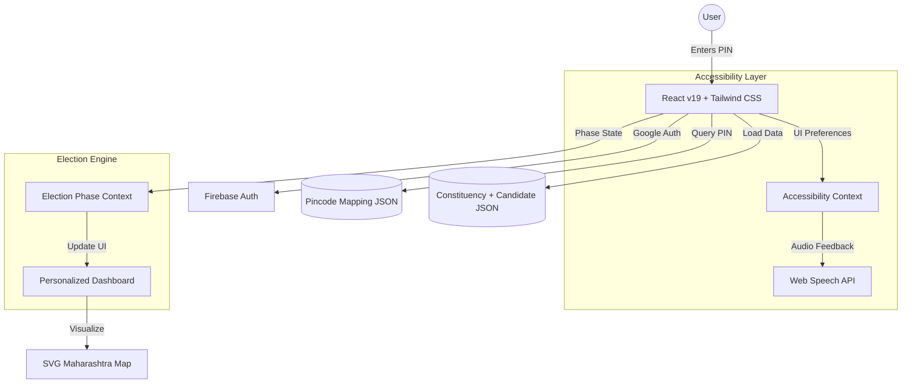

<h1><samp>🗳️ KnowYourVote</samp></h1>

### <samp>Understand your vote. Empower your choice.</samp>

  
  
  

  
  
  
  

---

## <samp>✨ Master Your Vote</samp>

### <samp>Interactive, Accessible, and Built for First-Time Voters</samp>

---

## <samp>🏛️ Vertical: CivicTech / GovTech</samp>
**KnowYourVote** is a specialized platform for **Election Literacy & Voter Awareness.** It is designed specifically for first-time voters and citizens who find the traditional political landscape fragmented and difficult to navigate.

---

## <samp>🧩 Core Features (Everything you need)</samp>

*   📍 **PIN-Based Detection:** Instant mapping from your location to your specific Lok Sabha constituency.
*   🗺️ **Interactive Maharashtra Map:** SVG-based visualization with dynamic constituency highlighting and data sync.
*   ⏳ **Election Lifecycle Engine:** A reactive system that simulates phases from **Voter Registration** to **Result Declaration**.
*   🧾 **Candidate Intelligence:** Deep-dive into candidate profiles, including party history and educational backgrounds.
*   ♿ **Accessibility Toolbar:** Real-time font scaling and high-contrast modes for inclusive usability.
*   🎙️ **Voice Accessibility:** Web Speech API integration for audio feedback and screen reader support.
*   🔐 **Secure Auth:** Seamless Google Login integration via Firebase.

---

## <samp>🏗️ System Architecture</samp>

---

## <samp>🚀 Approach & Logic</samp>

My approach focuses on **reducing cognitive load** by turning passive data into an active experience:

1.  **Contextual Logic:** By using PIN codes as the primary filter, the platform removes 99% of irrelevant data, leaving only what matters to the voter.
2.  **Visual Logic:** I used SVG maps and D3-based geo-data to ensure the user "sees" the borders and divisions of their constituency.
3.  **Dynamic Simulation:** The UI isn't static. It evolves as the election progresses, showing the user exactly what actions are required at each stage (e.g., "Register Now" vs "Check Results").

---

## <samp>🧠 Assumptions Made</samp>

- **2024 Lok Sabha Simulation:** The platform explicitly simulates the **2024 Lok Sabha Elections** using a robust, curated dataset for 5 major constituencies to demonstrate the end-to-end logic without external API latency.
- **Educational Intent:** The platform focuses on informational transparency rather than political comparison.
- **Digital Literacy:** Assumes basic smartphone/web access for urban and semi-urban voters.

---

## <samp>🛠️ Tech Stack</samp>

| Category | Technology |
| :--- | :--- |
| **Framework** | **React 19** (Modern, Concurrent UI) |
| **Styling** | **Tailwind CSS 4.0** + Framer Motion |
| **Database/Auth** | **Firebase** (Google Cloud Services) |
| **Accessibility** | **Web Speech API** + Accessibility Context |
| **Mapping** | **SVG Pathing** + D3.js Geo Logic |
| **Bundler** | **Vite** (Optimized Build Flow) |

---

### <samp>Developed by Saee Kumbhar</samp>

